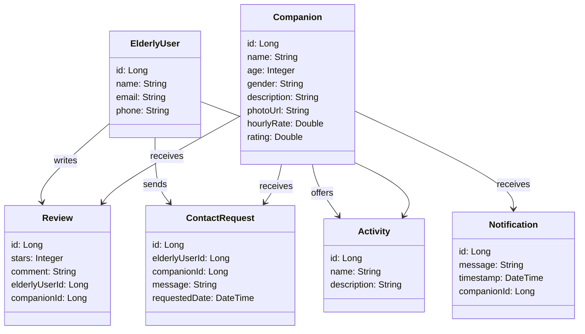

R diagram

```mermaid
classDiagram
class ElderlyUser {
    id: Long
    name: String
    email: String
    phone: String
}
class Companion {
    id: Long
    name: String
    age: Integer
    gender: String
    description: String
    photoUrl: String
    hourlyRate: Double
    rating: Double
}
class Activity {
    id: Long
    name: String
    description: String
}
class Review {
    id: Long
    stars: Integer
    comment: String
    elderlyUserId: Long
    companionId: Long
}
class Notification {
    id: Long
    message: String
    timestamp: DateTime
    companionId: Long
}
class ContactRequest {
    id: Long
    elderlyUserId: Long
    companionId: Long
    message: String
    requestedDate: DateTime
}
ElderlyUser --> Review : writes
Companion --> Review : receives
Companion --> Notification : receives
ElderlyUser --> ContactRequest : sends
Companion --> ContactRequest : receives
Companion --> Activity : offers
ElderlyUser --> Activity : selects
```

